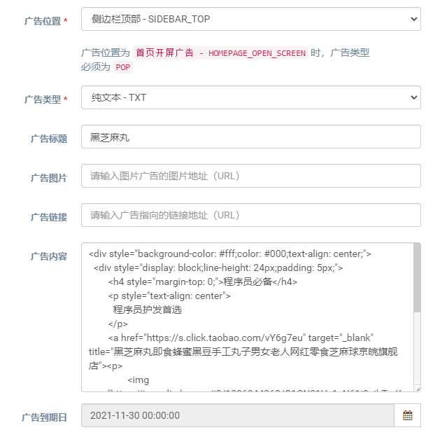
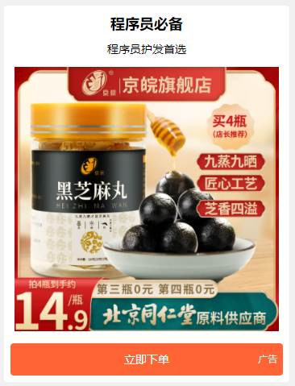
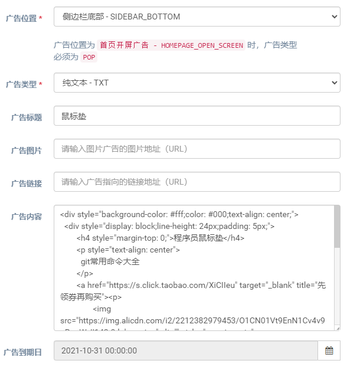
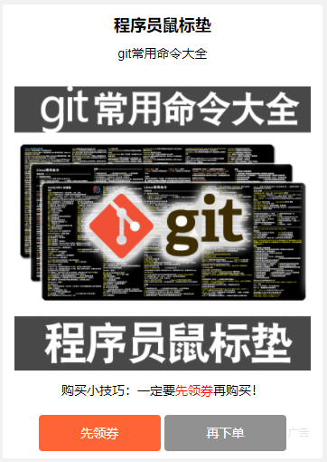

## 模板一：一张图片一个按钮

### 表单选项



### 广告内容

```html
<div style="background-color: #fff;color: #000;text-align: center;">
  <div style="display: block;line-height: 24px;padding: 5px;">
	<h4 style="margin-top: 0;">{主标题}</h4>
	<p style="text-align: center">
	  {副标题}
	</p>
	<a href="{购买链接}" target="_blank" title="{产品描述}"><p>
		
	  </p>
	</a>
  </div>
  <a href="{购买链接}" target="_blank" title="{产品描述}" style="display: inline-block;width: 100%;height: 40px;border-radius: 4px;background-color: #ff6434;color: #fff!important;text-align: center;line-height: 40px;cursor: pointer;">立即下单</a>
</div>
```

### 效果



## 模板二：一张图片两个按钮

### 表单选项



### 广告内容

```html
<div style="background-color: #fff;color: #000;text-align: center;">
    <div style="display: block;line-height: 24px;padding: 5px;">
        <h4 style="margin-top: 0;">{主标题}</h4>
        <p style="text-align: center">
            {副标题}
        </p>
        <a href="{购买链接}" target="_blank" title="先领券再购买"><p>
            
        </p>
        </a>
        <p style="text-align: center">
            购买小技巧：一定要<span style="color: #f00">先领券</span>再购买！
        </p>
    </div>
    <a href="{领券链接}" target="_blank" title="{产品描述}" style="display: inline-block;width: 40%;height: 40px;border-radius: 4px;background-color: #ff6434;color: #fff!important;text-align: center;line-height: 40px;cursor: pointer;">先领券</a>
    <a href="{购买链接}" target="_blank" title="{产品描述}" style="display: inline-block;width: 40%;height: 40px;border-radius: 4px;background-color: #919191;color: #fff!important;text-align: center;line-height: 40px;cursor: pointer;">再下单</a>
</div>
```

### 效果


