# 更新日志

----

### 2022-05-22

- 修改 CDN 资源
- 增加 CDN 资源引用文件的后台配置，当 CDN 不可用时，可以直接修改（如果没有则需添加）数据库中的下面四个配置：
  - adminJsCdn（控制台 JS 文件的 CDN）
  - adminCssCdn（控制台 CSS 文件的 CDN）
  - webJsCdn（Web 端 JS 文件的 CDN）
  - webCssCdn（Web 端 CSS 文件的 CDN）

注意：如果是手动操作数据库进行修改配置信息，则必须更改 `update_time`，并且更改后的 `update_time` 一定是晚于之前的 `update_time` 值。

关于如何配置以上四个属性，可以参考 blog-admin/src/main/resources/templates/config.ftl 文件中 `customJsCdnModal`、`customWebJsCdnModal`、`customCssCdnModal`、`customWebCssCdnModal` 提示框下的配置说明。 比如：
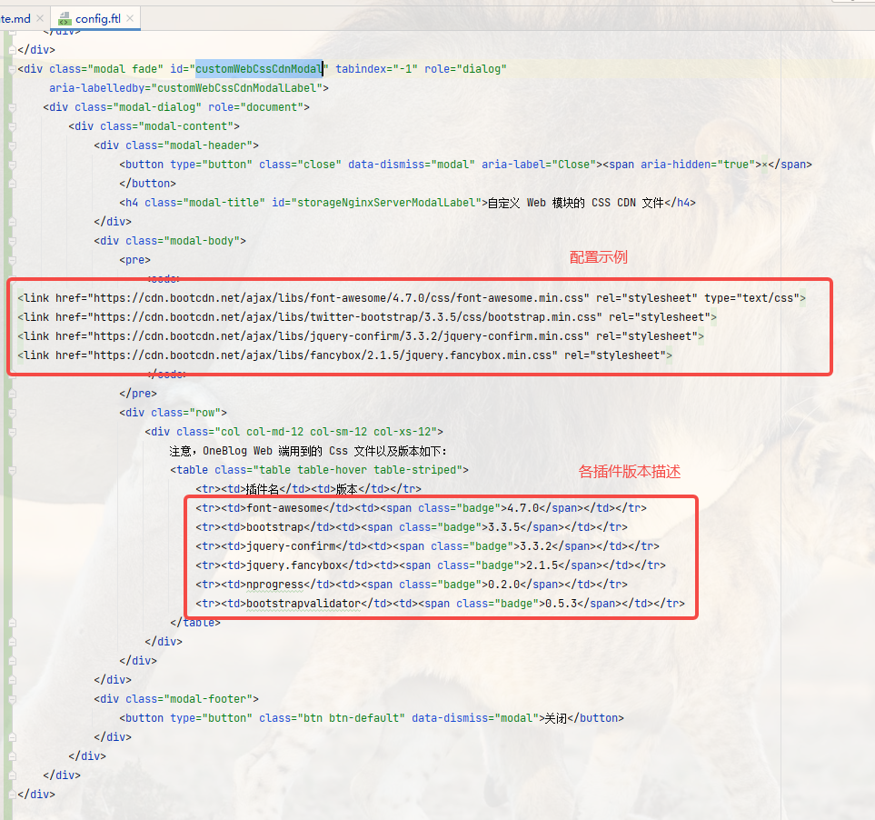

### 2021-11-01

- 增加定时任务：“每晚凌晨12点自动检查友联，对于私自取消友联的网站实行自动封禁”
- 文章支持设置【登录后可见】
- 优化web端的分类展示，支持以滚动菜单的形式展示分类，防止因分类太多导致菜单栏溢出的问题
- 支持禁用一言插件（该插件部分时候加载较慢）
- 文章长期未修改时，向用户提示

### 2021-10-29

- wangEditor 升级到 4.7.9
- 修复【文章搬运工】抓取文章失败的问题
- 新增 TinyMCE 编辑器 ([#I4FOB0](https://gitee.com/yadong.zhang/DBlog/issues/I4FOB0))
- 解决后台分页失败的问题 ([#I4FPMK](https://gitee.com/yadong.zhang/DBlog/issues/I4FPMK))
- fixed [#I165DP](https://gitee.com/yadong.zhang/DBlog/issues/I165DP)
- fixed [#I11TNT](https://gitee.com/yadong.zhang/DBlog/issues/I11TNT)
- fixed [#IZ7BD](https://gitee.com/yadong.zhang/DBlog/issues/IZ7BD)

### 2021-10-27

- **增加代码生成模块 `blog-codegen`，新业务支持一键生成所有代码**

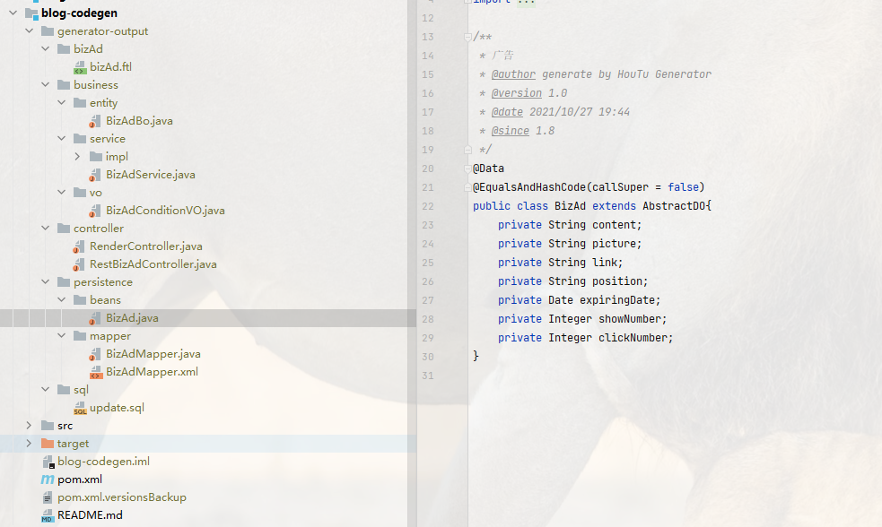

- 增加广告位

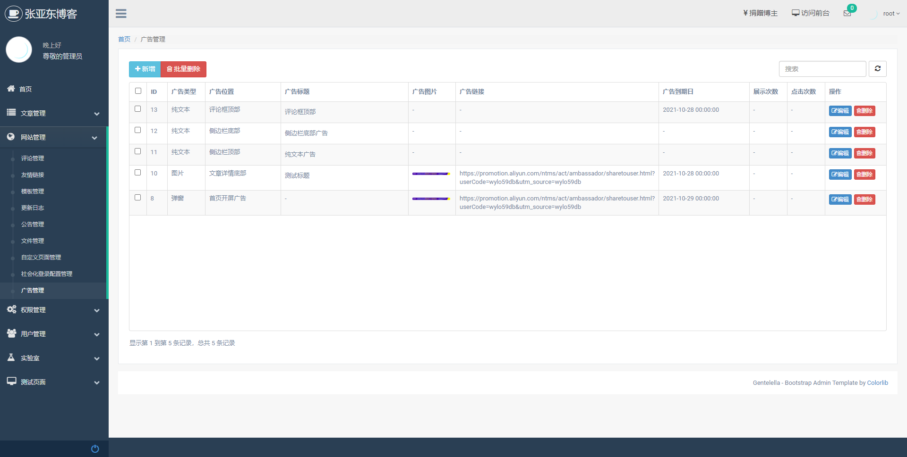
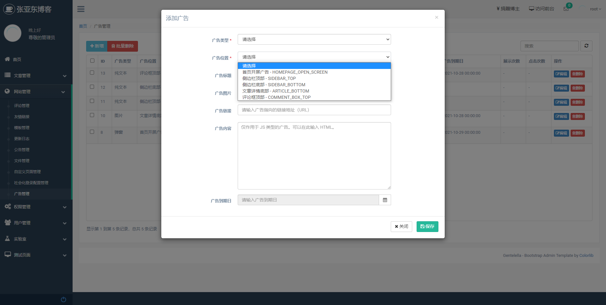
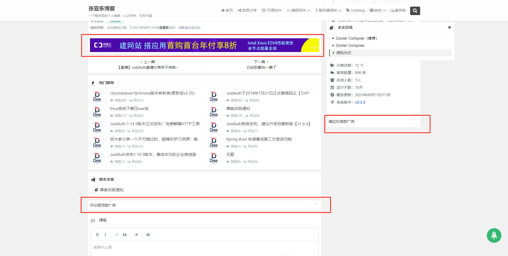
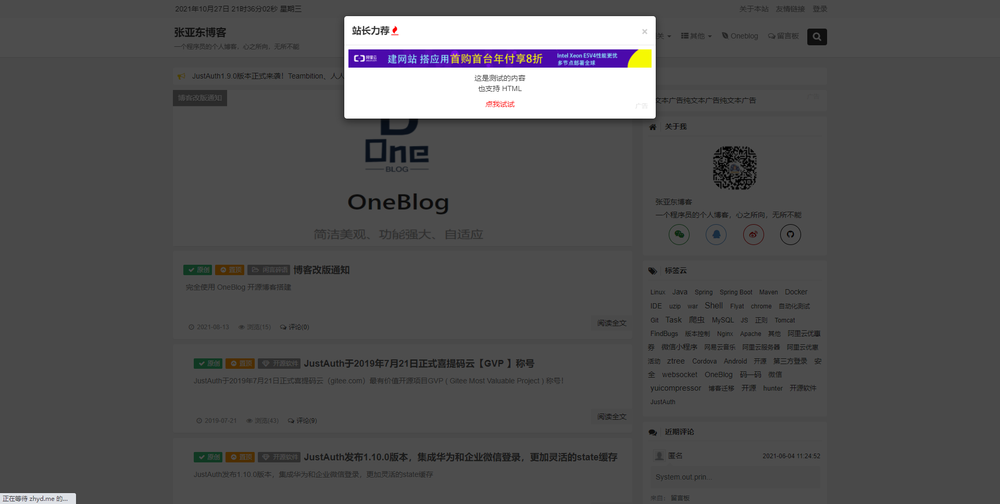
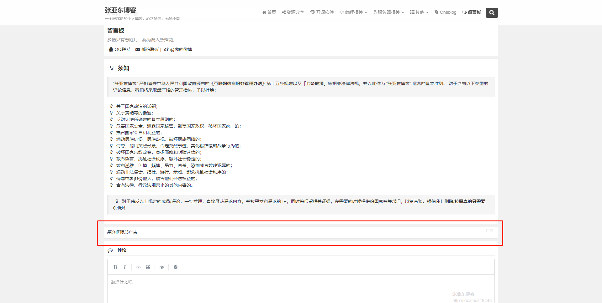

### 2021-10-26

- 修复第三方登录失败的问题
- 
### 2021-10-23

1. 优化页面样式。
2. 新增【自定义页面】的功能，方便对接第三方的网站验证（比如：百度站长通过文件验证时，需要将验证文件上传到服务器，现在可以直接在后台添加映射）。

比如在使用七牛云的 SSL 证书时，需要[对域名所有权进行验证](https://developer.qiniu.com/ssl/3667/ssl-certificate-of-free-dns-validation-guide)。当使用文件验证时，需要将文件放到项目根目录下，然后重新打包、上传、部署，非常不方便。

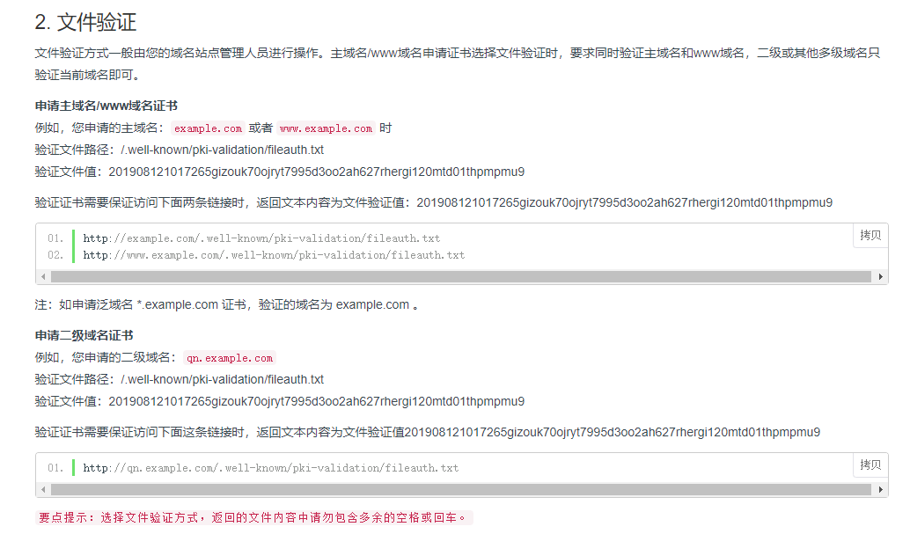

现在可以通过【自定义页面】功能快速完成文件地址映射：

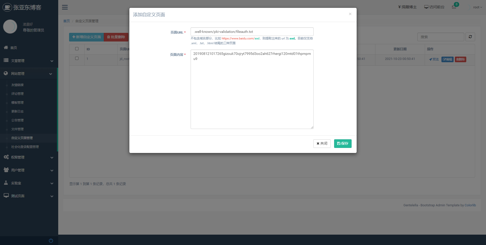

访问 http://localhost:8443/.well-known/pki-validation/fileauth.txt 

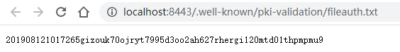

再比如在百度站长平台添加网站时，一般也需要对域名进行验证，此时也可以选择【文件验证】，如下：

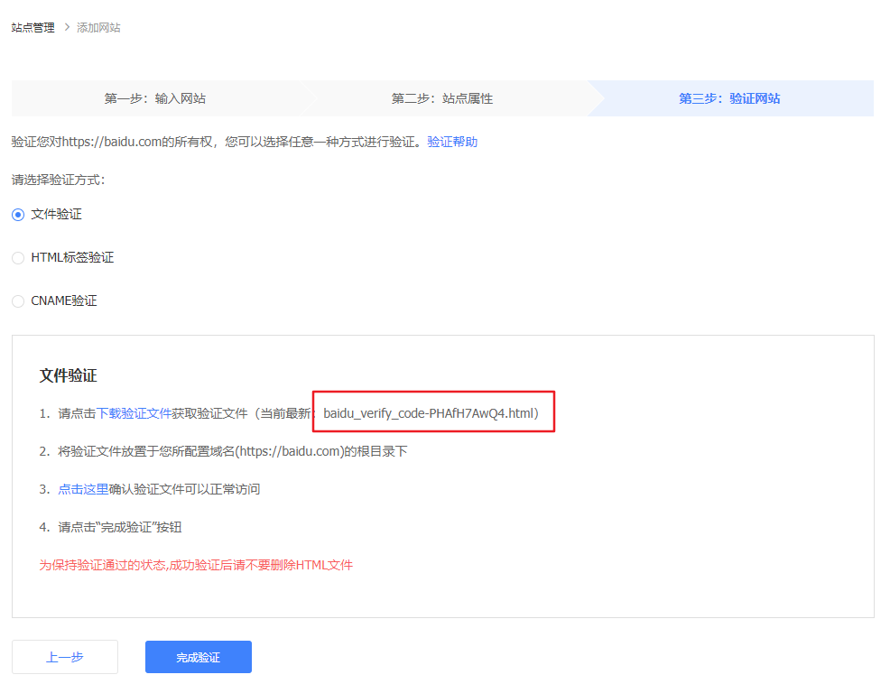

先将该文件下载下来，查看源码后获得授权码，然后通过【自定义页面】功能快速完成文件地址映射：

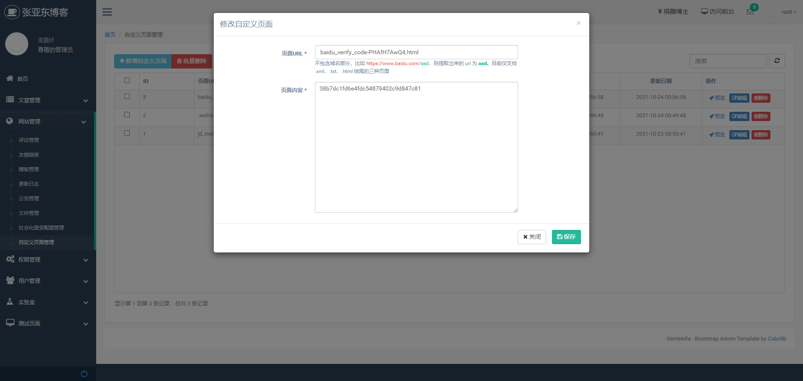

访问 http://localhost:8443/baidu_verify_code-PHAfH7AwQ4.html

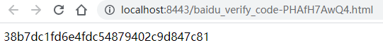

> 注意：目前该功能仅支持以下格式的url映射：
> 1. http://domain/{x}.xml
> 2. http://domain/{x}.txt
> 3. http://domain/{x}.html
> 4. http://domain/.well-known/{x}/{x}.txt
> 
> 对于其他类型的 url 格式，请提交 issue

### 2021-06-06

1. 处理了一批 Issue
    - 解决 Gitee Issue [#I3PIH2]
    - 解决 Gitee Issue [#I1G3XV]
	- 解决 Gitee Issue [#I3I8KC]
	- 等等一些老旧 Issue
2. blog-hunter 的配置文件（文件搬运工），支持通过 admin 端在线配置
3. 更新后台首页统计面板
    - 后台管理员首页增加总访问量和总赞数选项卡
	- 点击总访问量，提示具体访问量数字，选项卡中只显示大概访问量，例如（2.3w,1.2k等）
4. 鼠标点击弹出气泡文字，默认不显示，只有在后台配置了弹出文字后才会显示
5. 将 jap-social 升级到 1.0.2
6. 增加自定义“JS”的配置项，可通过后台动态添加web端的js脚本，比如百度统计等
7. admin 端首页的弹窗支持关闭后不再显示
8. 适配 csdn 平台 spider 规则
9. 支持自定义的 web 端的 css
10. 将 footer 中的 Powered by 提出。自定义 footer 不会覆盖掉 "Powered by"。建议保留版权，谢谢！
11. 将 footer 中的 “友情链接” 提出。自定义 footer 不会覆盖掉 “友情链接”
12. 更新获取 qq 昵称的接口
13. 合并 Github PR [#22]，解决发布文章时,点击标签名，页面无法选择中对应的标签的问题
14. 修复一些其他问题

### 2021-04-27

1. 修改一言类型为诗词
2. 添加文章默认封面图片
3. 调整 web 端页面风格，参考：[蛋码农 - https://www.dancoder.cn](https://www.dancoder.cn/)
4. 文章支持加密，加密后的文章需要验证密码后才能查看详情，默认只能看文章的介绍
5. 修改 web 端分类菜单的 sql 查询条件，已禁用的分类不再显示
6. 增加 admin 端系统配置页面部分配置项的说明，请按照说明进行配置
7. web 端所有图片容易死链的地方，添加了默认图片
8. 留言板页面添加**正能量**提示
9. 添加自定义“关于本站”、“留言板”、“友情链接”、“免责声明”、“Footer”、“鼠标点击时的气泡文字”、“热门搜索的待选项”等内容
10. 去掉 web 端侧边栏中的 Gitee Fork Me 链接
11. 使用 [JustAuthPlus（JAP）](https://gitee.com/fujieid/jap) 替换 [JustAuth](https://gitee.com/yadong.zhang/JustAuth)
12. 后台管理系统增加社会化登录的配置，可以在线添加、启用、禁用某个平台的第三方登录功能
13. 调整部分依赖 JAR 的版本
14. 其他 BUG 修复

----

### 2019-07-08

1. 修复Github Issue #15 标签无法点击的问题
2. 后台文章分类管理页面，增加父级分类展示
3. 后台文章管理页面文章缩略图尺寸调整
4. 修改`RequestUtil.getParametersMap`方法
5. 解决Gitee Issue #IYTTM 文件管理没有分页功能的问题

----

### 2019-07-06

1. 初次使用项目未执行init_data.sql导致报错时，给出确切的提示
2. 微调前台页面样式，后台多级菜单显示优化
3. 新增动态标题，可配置切换标题后的显示内容，去掉默认的页面压缩
4. 修复后台未配置loading图片，前台文章列表不显示图片的问题

----

### 2019-07-01

1. 修改cdn为jsdelivr
2. 修复后台发表文章-选择图片时，首次打开图片素材库图片无法正常加载的问题
3. 支持打印数据库（mysql & redis）配置属性，主要用来测试时查看数据库配置是否正常
4. 修改freemarker过时语法的问题
----

### 2019-06-26

1. 修复部分BUG
2. 网站版权信息、备案号、懒加载图片支持后台配置，无需手动修改页面信息
3. 去掉前台项目种一些无用的链接

----

### 2019-06-01

1. 集成JustAuth，修复一些问题  
2. 支持开关“匿名评论”，非匿名时，必须登录才能发表评论
3. 修复其他问题     

----

### 2019-05-29

1. 修复异步线程中无法获取request的问题;    
2. 修复文章列表不绑定标签时的NPE问题; 
3. 修复其他问题     
    
----

### 2019-05-26

1. 修复zhyd.table.js插件中`clearText`方法的一个小问题；
2. 集成JustAuth
3. 修复一些bug

----

### 2019-05-24

1. 优化后台zhyd.table.js的实现方式，让插件使用起来更方便；
2. 修复文章分类添加时，父级分类能选择自己的问题；
3. type和resource列表页改为父子表；
4. 调整后台管理页面中的按钮样式，去掉文字说明，改为title形式显示，节省列表空间；  
5. 发布文章时的默认编辑器可以通过右上角“系统配置”-“文章编辑器”设置；
6. 修改右上角消息通知的实现方式；
7. 修复zhyd.table.js插件中`clearText`方法的一个小问题；
8. 发布文章页中切换编辑器时弹出确认提示框；

----

### 2019-03-22

1. 切换cdn;    
2. 异步记录系统日志;    
3. 实时保存文章浏览记录改为定时保存，每分钟保存一次    
    

----

### 2019-03-11

- 删除blog-spider模块，改为依赖blog-hunter工程的方式实现文章搬运工功能
- 优化“文章搬运工”功能
- 优化blog-file相关的逻辑
- init_data.sql中增加Nginx服务器的配置文件
    
    

----

### 2019-02-15

> 注： 该版本中，发布文章时的文章封面改为了全路径，所以以前的文章的封面图片会 **显示异常**，需要批量修改一下biz_article表，将cover_image改为全路径。具体实现SQL详见`update.sql`,也可自行修改

修改之前务必请先备份数据！！！
修改之前务必请先备份数据！！！
修改之前务必请先备份数据！！！

- 新增
	- 文件资源库管理，可删除、批量删除和上传图片等操作
- 修改
	- 将发布文章选择封面图片时的素材库由原来的查询文章封面列表改为现在的文件库表，可以选择库中所有的图片记录

    
    

----

### 2019-02-14

- 新增
	- 文件资源库管理，可删除、批量删除和上传图片等操作
- 修改
	- 文章详情页的样式调整
    
    
----

### 2019-02-12~2019-02-13

- 新增
	- 文件资源库，项目中所有上传的文件统一保存到file表中
	- 项目中的文件存储默认为本地存储，需要按照例子自己配置本地文件服务器
	- 文件云存储支持阿里云OSS和本地存储
- 修改
	- sys_config相关的逻辑，删除BaseConfig类
	- jquery-confirm插件升级：v2.5.1 -> v3.3.2
	- 后台评论管理列表样式修改
- 其他
    - 删除一些无用的文件
	
	
----

### 2019-01-28

- 处理issue：
	- Fixed issue : [IN4T1](https://gitee.com/yadong.zhang/DBlog/issues/IN4T1)
	- Fixed issue : [IN807](https://gitee.com/yadong.zhang/DBlog/issues/IN807)
	- Fixed issue : [IO4P6](https://gitee.com/yadong.zhang/DBlog/issues/IO4P6)
	- Fixed issue : [IO5HQ](https://gitee.com/yadong.zhang/DBlog/issues/IO5HQ)
	- Fixed issue : [IOWDY](https://gitee.com/yadong.zhang/DBlog/issues/IOWDY)
	- Fixed issue : [IP2I1](https://gitee.com/yadong.zhang/DBlog/issues/IP2I1)
- 新增：
	- admin项目中，在面包屑导航列新增一个系统通知（友情提示）
- 修改：
	- web项目中，“更新记录”页面重构
	- admin项目中，“推送消息”页面重构，以后准备做个简单的聊天通讯工具
	- admin项目中，重构wangEditor&simpleMDE编辑器的生成代码
	- admin项目中，拆分gentelella模板的js代码和自定义的js代码
	- admin项目中，发表文章时可以新增标签，避免了必须得去标签页添加的问题
	
	
----

### 2019-01-26

- 修改：
	- 首页消息提示、面包屑导航样式修改
	- 首页文章列表样式微调，修改文章页脚的字体位12px，看起来分为主次次
	- sidebar调整“近期评论”、“文章列表”、“网站信息”栏的字体颜色
	- sidebar中的“文章列表”tabs增加图标，同时增加空数据提示
	- footer样式调整，删除上方的自定义footer，同时修改footer中的字体
	“关于”、“友情链接”、“留言板”样式调整
	- “文章详情”页面样式调整：标题和文章主题之间的界限调整，去除以前的灰色分割线，使文章标题和内容之前看起来不这么生硬。
	- “文章详情”-“目录”样式微调
	- “文章列表”查询优化
	- 代码整理，删除一些无用的代码，去掉一些无意义的注释。
	- RedisCache中增加一个enable参数，当指定为false时将不会进行缓存

----

### 2019-01-24

- 修改：
	- 搬运工增加爬取单个文章的功能
	- 调整spider提示内容

----

### 2019-01-21

- 修改：
	- 修改sys_config表数据结构，便于扩展内容。 升级时请注意备份本地sys_config表数据
- 删除：
	- 删除一些无用的文件

----

### 2019-01-04

- 新增：
	- 数据库支持emoji表情，解决抓取文章时如果文章中存在emoji表情导致保存失败的问题
- 修改：
	- 将redis的配置挪到具体的profile中，每个环境下的redis配置应该是不相同的
	- 将数据库初始化语句单独提出到init_data.sql，方便一键还原数据库
	- 文章列表页批量发布后刷新列表页
	- zyd.table.js中去掉了表格上方的修改内容列和视图切换的按钮（并没什么卵用），同时将默认的glyphicon图标修改为font-awesome图标
	- 用户操作日志表中单独记录请求参数，并且将参数改为json格式
- 删除：
	- 删除一些无用的文件

----

### 2018-10-10

- 新增：
	- 图片转存功能支持CSDN
	- “文章搬运工”可选的停止方式：
		- 默认：不做限制，抓取所有匹配到的文章，慎用
        - 持续时间：按照爬虫运行的时间，理想状态时1s抓取一条，受实际网速影响
        - 链接条数：按照指定的条数抓取，满足条数后程序自动停止
	- 日志管理，记录用户的操作日志
- 修改：
	- 建站日期提到配置文件中，可手动配置。通过buildWebsiteDate指定建站起始日期，默认2018-01-01
	- 文章管理页调整，去掉不重要的列，增加一键开关，使之更加便于管理
	- 重构后台管理的首页，显示重要的信息：文章数、标签数等数量统计和文章分类统计、爬虫统计等
	- 部分页面调优
	- 文章分类页的排序
- 删除：
	- 删除CnblogModel等无用的测试实体类
- 修复其他一些bug
	

----

### 2018-09-11

- “文章搬运工”支持博客园的文章迁移
- “文章搬运工”已支持自动转存文章图片到七牛云，只需在“文章搬运工”中手动开启**自动转存图片**即可

*注：转存图片功能尚不能转存csdn的图片，下一版会更新*

----

### 2018-08-29

**新增**
- wangEditor编辑器添加复制粘贴图片的功能

----

### 2018-08-24

**新增**
- 新增“文章搬运工”功能，支持博客文章一键迁移，示例见：[视频演示](https://gitee.com/yadong.zhang/static/raw/master/dblog/DBlog-%E6%96%87%E7%AB%A0%E6%90%AC%E8%BF%90%E5%B7%A5%E7%A4%BA%E4%BE%8B.webm)

----

### 2018-07-20

**改进**
- 集成YUI compressor实现js、css文件的自动压缩

----

### 2018-07-15

**修复**
- 解决使用rememberme时偶发性出现重定向错误的问题。
- 解决rememberme无效的问题。

----

### 2018-07-13

**修复**
- 解决wangEditor编辑器下图片丢失的问题。造成原因：上传完图片如果未进行其他操作，则不会触发编辑器的“change”事件，导致实际文章内容中缺少最后上传的图片文件

----

### 2018-07-05

**修改功能：**

修改：      
- config表中新增`cmd_url`字段，存储后台管理系统的地址  
- websocket支持移到admin模块
- 添加了管理员向在线用户端发送消息通知的功能（需用户端授权）

   
----

### 2018-06-27

**修改功能：**

优化：      
- @blogHeader宏标签数据动态获取      
- 开启websocket的逻辑调优，host从config表中获取    
- 项目readme文档完善并拆分    
- 项目maven版本修改为`2.0.1.Beta`

增加：
- ISSUE和PR的模板    

----

### 2018-06-20

**修改功能：**

优化：  
- 升级Spring Boot至2.0.1版本及其他关联版本升级；  
- 使用Maven Profile管理Spring Boot Profiles，支持动态切换profile；

----

### 2018-06-10

**修改功能：**

新增：    
- markdown版的编辑器、评论框    
- 控制文章的评论框是否显示    
- 修改密码功能    
优化：相关页面进行优化    

----

### 2018-06-05

**修改功能：**

修复： admin用户首页报错的问题    

优化：
1. ROOT用户默认拥有所有权限
2. admin页面改为macro引用的方式
3. 登录界面
4. 日志记录

----

### 2018-05-25

**修改功能：**

1. 修复后台标签等分页失败的问题
2. 修复前台自动申请友链失败的问题
3. 其他一些问题

----

### 2018-05-22

**修改功能：**

1. 完善shiro权限（数据库、页面）。注：需要重新执行下`sys_resources`和`sys_role_resources`两张表的`insert`语句
2. redis配置默认不含密码（鉴于大多数朋友的redis都没有密码做此修改，不过本人 **强烈建议**设置下密码）

----

### 2018-05-18

**修复bug：**

1. web端自动申请友链后不显示的问题
2. config表修改后不能实时刷新的问题
	
**增加功能：**
1. 网站赞赏码
2. 百度推送功能(链接提交到百度站长平台)
	
**修改功能：**
1. 百度api的ak和百度推送的token以及七牛云的配置改为通过config表管理
3. admin模块菜单通过标签实时获取
3. 弹窗工具类js结构调整
